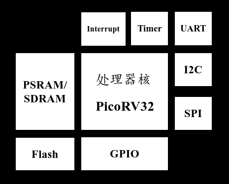

# OpenSoC

An Open Source Game Console SoC

开源复古掌机SoC 

## SoC Architecture

处理器采用RISC-V处理器PicoRV32，支持硬件中断、定时器、UART、I2C、SPI、GPIO、Flash、SDRAM

已FPGA上板验证 iCESugar-Pro (Lattice ECP5)

## 软件

- 简单封装了外设库
- 已移植PMOD-LCD-0.96屏幕驱动
- 已移植以下游戏，游戏代码来自[CH32V003-GameConsole](https://github.com/wagiminator/CH32V003-GameConsole)

## Usage

请先根据`requirements.txt`配置Python环境，然后根据`Makefile`生成SoC